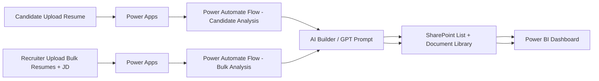

# Resume-Scanner-App
An **AI-powered Resume Scanner** built with **Power Apps, Power Automate, SharePoint, and Power BI** to streamline both **candidates’ resume improvement** and **recruiters’ shortlisting process**.

## 🔑 **Two-Way Solution**

* 🎯 **For Candidates** → Upload resumes, get **ATS-style scores**, **AI-driven suggestions**, and **improvement areas** tailored to specific roles.
* 🏢 **For Recruiters** → Upload **bulk resumes + job description**, automatically generate **ATS scores**, **matched skills**, and **shortlist ranking**.
* 📊 **For Management** → View **insights & KPIs** with integrated **Power BI dashboards**.

## ✨ **Features**

### 🔹 **Candidate Side (Resume Improvement)**

* Upload your **resume** along with the **target job role/field**.
* AI evaluates **structure, grammar, spelling, action verbs, and bullet points**.
* Resume scored on **ATS-friendliness & job role match**.
* Suggestions provided to **strengthen the resume** (fill **skills gaps**, remove **repetition**, suggest **better phrasing**).
* Detailed **report generated** with **score + improvement recommendations**.

### 🔹 **Recruiter Side (Bulk Screening)**

* Upload **multiple resumes + job description** (from **SharePoint library**).
* Automatically generates:

  * ✅ **ATS Score** for each resume
  * ✅ **Matched Skills & Projects** aligned with JD
  * ✅ **Unmatched Skills** (missing from candidate’s resume)
  * ✅ **Shortlisting Order** (highest-scoring resumes at top)
* Summarized **profile view** for faster decision-making.

### 🔹 **Analytics (Power BI Integration)**

* **KPIs for recruiter-side analysis**, including:

  * **Number of resumes processed**
  * **Top skills matched** across applicants
  * **Distribution of resume scores**
  * **Shortlisted vs non-shortlisted ratio**
* **Visual reports embedded directly** into **Power Apps**.

## 🏗️ **System Architecture**

## ⚙️ **Tech Stack**

* **Power Apps** → Frontend app for candidates & recruiters
* **Power Automate** → Backend automation for resume parsing, AI analysis, and scoring
* **AI Builder / GPT** → Intelligent resume scoring & improvement suggestions
* **SharePoint (List & Document Library)** → Storage for resumes, job descriptions, and analysis results
* **Power BI** → Visual dashboards for recruiter insights

## 🔄 **How It Works**

### 👤 **Candidate Workflow**

1. Candidate **uploads resume + selects job role**
2. **Power Automate** extracts skills, structure, and content
3. **AI** analyzes grammar, skills match, and overall strength
4. Candidate receives:

   * 📊 **Resume Score**
   * 📝 **Suggestions for improvement**
   * 📑 **AI-powered Report**

### 🏢 **Recruiter Workflow**

1. Recruiter **uploads job description + bulk resumes**
2. **Power Automate** parses all resumes
3. **AI** evaluates each resume against job description
4. System generates:

   * 📊 **ATS Score per resume**
   * ✅ **Skills matched / missing**
   * 🏅 **Shortlisting Rank**
5. Results stored in **SharePoint** and visualized in **Power BI**

## 🎥 **Live Demo**

Watch the demo here: [▶️ Click to view](https://drive.google.com/drive/folders/1X_Z9jqwYLQ6syLvILCVq8z7KL3AFk9wf?usp=sharing)

## 🧠 **Key Learnings & Optimizations**

* Integrated **AI Builder / GPT with Power Automate** for NLP analysis
* Designed optimized **flows for bulk resume parsing** with minimal API calls
* Embedded **Power BI dashboards inside Power Apps** for seamless recruiter experience
* Resolved **delegation & large dataset issues** using flows for row counts & aggregation

## 🚀 **Future Enhancements**

* Add **multi-language resume support**
* Integrate **LinkedIn / Indeed API** for live job-role requirements
* Enable **export to PDF** for candidate improvement reports
* Provide recruiter **auto-email notifications** with shortlisted resumes
* Build a **public demo version** with sample data

## 🛠️ **Setup Guide (For Re-Creation)**

### 🔹 **1. SharePoint Setup**

* Create a **Document Library** for resumes & job descriptions
* Create a **List** to store analysis results (fields: Candidate Name, ATS Score, Matched Skills, Missing Skills, Report Link)

### 🔹 **2. Power Automate**

* **Flow 1: Candidate Resume Analysis** → Trigger: Power Apps → Action: AI Builder + JSON parsing → Save to SharePoint
* **Flow 2: Recruiter Bulk Resume Analysis** → Trigger: Power Apps → Loop resumes → Extract & analyze → Store results in SharePoint

### 🔹 **3. Power Apps**

* **Candidate Screen** → Upload resume + job role → Calls Flow 1
* **Recruiter Screen** → Upload resumes + JD → Calls Flow 2
* **Integrated Power BI Dashboard** → Embedded for recruiter analytics

### 🔹 **4. Power BI**

* Connect to **SharePoint List**
* Build visuals: **Resume Score Distribution, Top Skills, Shortlisted Candidates**
* **Publish & Embed** into Power Apps

## 🙌 **Acknowledgements**

* **Microsoft Power Platform** → for enabling low-code AI-driven apps
* **OpenAI/GPT** → for text analysis & smart resume suggestions
* Inspired by **ATS resume scanners** & **recruiter workflow optimization**

## 📢 **Connect**

If you found this project useful, feel free to ⭐ **star the repo** and connect with me on **[LinkedIn](https://www.linkedin.com/in/deepikaa-vadivel-09ba2037a/)** 🚀

